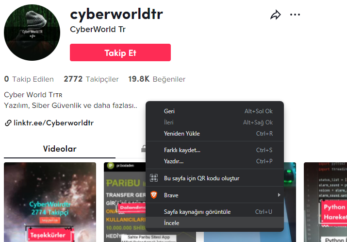
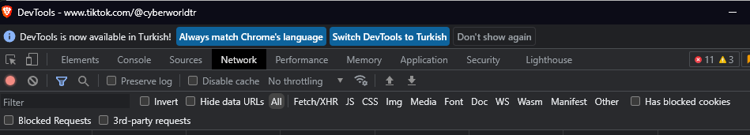
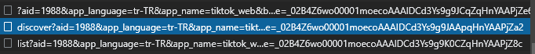

# Tiktok Takipci Çekme!
## Güncellemeler!

Api Sıkıntısı Giderildi Test Edildi

Takip Edilen Modülü Eklendi Test Edildi

Takipçi Çekme Modulü: <a href="/takipci.py"> takipci.py </a>

Takip Edilen Çekme Modülü: <a href="/takipedilen.py"> takipedilen.py </a> 

Kurulum
=
    git clone https://github.com/CyberWorldTr/Tiktok-Takipci-Api.git
    pip install requests

## Api Key Almak İçin
<a href="https://scraptik.com/">Scraptik</a>

 X-RapidAPI-Key Yazan Bölüm Api Keyinizdir!!

Api Ücrestiz Versiyonda 50 Adet Sorgu İle Sınırlıdır!

## Tiktok User ID Bulmak

Öncelikle Tiktok'a Girip Kullanıcı Sayfasına İncele Diyoruz

Daha Sonra Network Kısmını Seçiyoruz

Network Kısmından Discover İle Başlayan GET Sorgusunu Açıyoruz

Payload Bölümünde Alt Kısımda userId: Bilgisini Göreceksiniz

