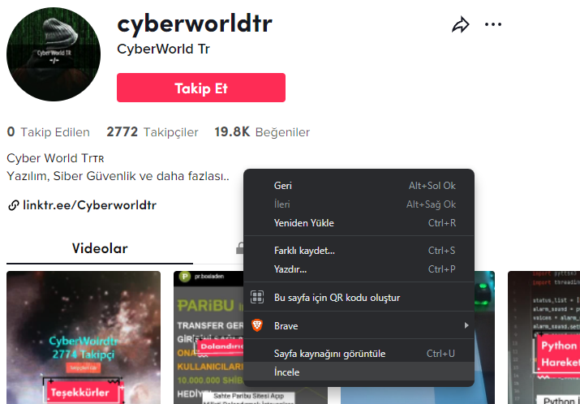
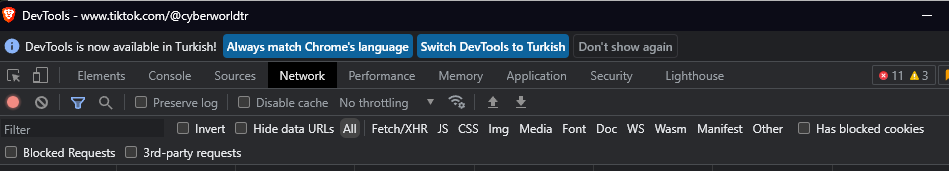
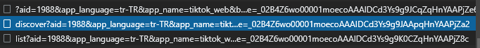

# Tiktok Takipci Çekme!

Kurulum
=
    git clone https://github.com/CyberWorldTr/Tiktok-Takipci-Api.git
    pip install requests

## Api Key Almak İçin

Api Ücrestiz Versiyonda 50 Adet Sorgu İle Sınırlıdır!

<a href="https://scraptik.com/">Scraptik</a>

 X-RapidAPI-Key Yazan Bölüm Api Keyinizdir!!

## Tiktok User ID Bulmak

Öncelikle Tiktok'a Girip Kullanıcı Sayfasına İncele Diyoruz

Daha Sonra Network Kısmını Seçiyoruz

Network Kısmından Discover İle Başlayan GET Sorgusunu Açıyoruz

Payload Bölümünde Alt Kısımda userId: Bilgisini Göreceksiniz

